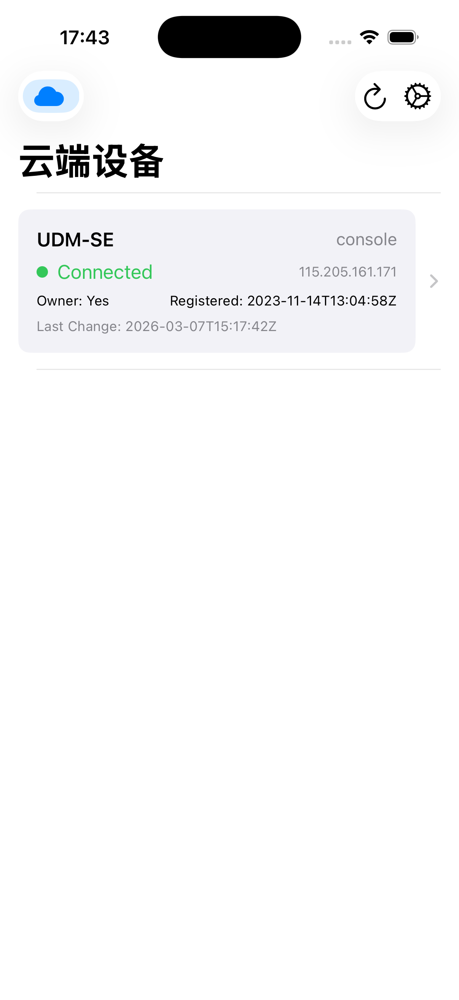
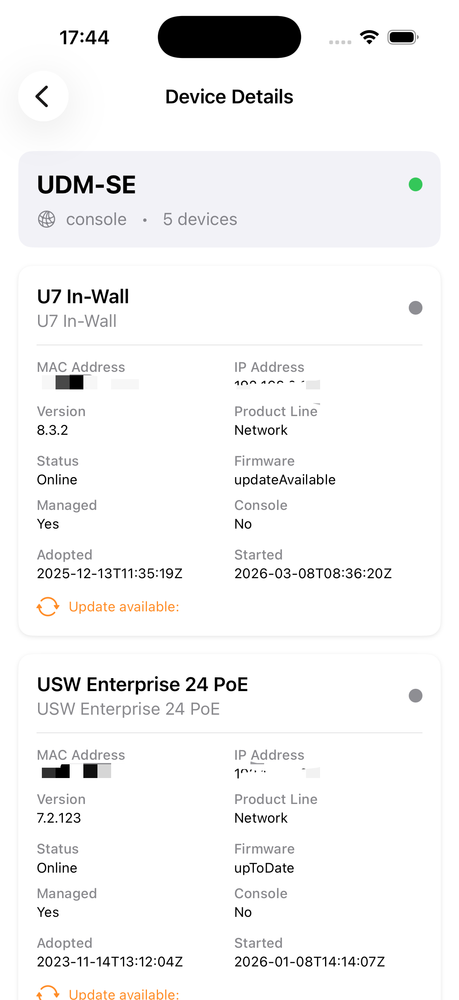

# UBNT Monitor

<p align="center">
  
  
  
  
</p>

<p align="center">
  <b>一款用于监控和管理 Ubiquiti (UniFi) 网络设备的 iOS 应用</b><br>
  支持云端 API 和本地局域网直连两种模式
</p>

<p align="center">
  <a href="#功能特性">功能特性</a> •
  <a href="#系统要求">系统要求</a> •
  <a href="#安装指南">安装指南</a> •
  <a href="#使用说明">使用说明</a> •
  <a href="#截图">截图</a> •
  <a href="#技术架构">技术架构</a> •
  <a href="#贡献指南">贡献</a> •
  <a href="#许可证">许可证</a>
</p>

---

## 📱 功能特性

### 🌐 双模式支持
- **云端模式** - 通过 Ubiquiti 官方 API 远程管理设备
- **局域网模式** - 直连路由器获取更详细的信息

### 📊 设备监控
- 查看设备列表和在线状态
- 查看设备详情（型号、固件版本、IP 地址等）
- 查看端口状态和 WiFi 射频信息
- 查看客户端连接信息

### ⚡ 设备管理
- 重启设备
- PoE 端口电源循环

### 🔐 安全特性
- 所有凭证安全存储在 iOS Keychain
- 局域网模式支持证书固定（Certificate Pinning）
- 仅支持私有 IP 地址（防止 SSRF 攻击）
- 支持生物识别/密码保护（可选）

---

## 💻 系统要求

- **iOS**: 15.0 或更高版本
- **Xcode**: 15.0 或更高版本（用于自行编译）
- **Swift**: 5.9+

### 网络要求

**云端模式**:
- 需要互联网连接
- Ubiquiti 账户和 API Key

**局域网模式**:
- 设备必须与 UniFi 控制台在同一局域网
- UniFi 控制台需启用 API 访问

---

## 📥 安装指南

### 从 App Store 安装（推荐）

> 即将上架，敬请期待

### 自行编译安装

1. **克隆仓库**
   ```bash
   git clone https://github.com/linxuchuan/ubnt-monitor.git
   cd ubnt-monitor
   ```

2. **打开项目**
   ```bash
   open ubnt-monitor.xcodeproj
   ```

3. **编译运行**
   - 在 Xcode 中选择你的 iOS 设备或模拟器
   - 按 `Cmd+R` 运行

> ⚠️ **注意**: 自行编译需要有效的 Apple Developer 账户才能在真机上运行。

---

## 🚀 使用说明

### 首次启动

1. 打开应用后选择连接模式：
   - **互联网版本** - 使用 Ubiquiti 云端 API
   - **局域网版本** - 直接连接路由器

2. 根据所选模式配置：
   - **云端**: 输入 Ubiquiti API Key
   - **局域网**: 输入路由器地址和 API Key

3. 测试连接并保存

### 获取 API Key

**云端 API Key**:
1. 访问 [account.ui.com](https://account.ui.com)
2. 进入 Settings → API Access
3. 创建新的 API Key

**局域网 API Key**:
1. 登录 UniFi 控制台（如 https://192.168.0.1）
2. 进入 Settings → Control Plane → Integrations
3. 创建 API Key

详细配置指南请查看 [CONFIGURATION_GUIDE.md](./CONFIGURATION_GUIDE.md)

---

## 📸 截图

| 模式选择 | 设备列表 | 设备详情 |
|---------|---------|---------|
|  |  |  |

> 截图即将添加

---

## 🏗️ 技术架构

本项目采用 **MVVM 架构**，使用 **SwiftUI** 构建用户界面。

```
ubnt-monitor/
├── App/                    # 应用入口
├── Core/                   # 核心层
│   ├── Networking/         # 网络服务
│   ├── Security/           # Keychain 安全存储
│   └── Extensions/         # 扩展
├── Features/               # 功能模块
│   └── Devices/            # 设备管理
│       ├── Models/         # 数据模型
│       ├── ViewModels/     # 视图模型
│       └── Views/          # 视图
└── Resources/              # 资源文件
```

项目采用 MVVM 架构，代码组织清晰，详见源代码注释。

### 技术栈

- **UI 框架**: SwiftUI
- **架构模式**: MVVM
- **并发**: Swift Concurrency (async/await)
- **网络**: URLSession
- **安全**: Keychain, Certificate Pinning
- **最低版本**: iOS 15.0

---

## 🔒 安全说明

本项目重视安全性，实现了以下安全措施：

- ✅ API Key 使用 Keychain 安全存储（不备份）
- ✅ 局域网模式支持证书固定
- ✅ 仅允许私有 IP 地址范围
- ✅ 最小权限原则

详细安全配置请查看 [SECURITY_GUIDE.md](./SECURITY_GUIDE.md)。

### 生产部署检查清单

部署到生产环境前，请确保：

- [ ] 配置了证书固定的公钥哈希
- [ ] 使用 Release 配置编译
- [ ] 移除了所有调试日志

---

## 🤝 贡献指南

我们欢迎所有形式的贡献！请查看 [CONTRIBUTING.md](./CONTRIBUTING.md) 了解如何参与项目。

### 快速开始

1. Fork 本仓库
2. 创建你的功能分支 (`git checkout -b feature/AmazingFeature`)
3. 提交更改 (`git commit -m 'Add some AmazingFeature'`)
4. 推送到分支 (`git push origin feature/AmazingFeature`)
5. 创建 Pull Request

### 行为准则

本项目采用 [Contributor Covenant](https://www.contributor-covenant.org/) 行为准则。参与项目即表示同意遵守。请查看 [CODE_OF_CONDUCT.md](./CODE_OF_CONDUCT.md) 了解详情。

---

## 📋 待办事项 (Roadmap)

- [ ] 支持更多设备操作（升级固件、配置备份等）
- [ ] 推送通知（设备离线提醒）
- [ ] iPad 适配
- [ ] 小组件支持
- [ ] Apple Watch 应用
- [ ] 多站点管理
- [ ] 流量统计图表

查看 [Issues](https://github.com/linxuchuan/ubnt-monitor/issues) 了解正在进行的开发工作。

---

## 🐛 问题反馈

如果你遇到问题或有功能建议：

1. 查看 [Issues](https://github.com/linxuchuan/ubnt-monitor/issues) 是否已有类似问题
2. 如果没有，创建新的 Issue 并详细描述：
   - 问题描述
   - 复现步骤
   - iOS 版本
   - 应用版本
   - 截图（如有）

---

## 📄 许可证

本项目基于 [MIT 许可证](./LICENSE) 开源。

```
MIT License

Copyright (c) 2026 linxuchuan

Permission is hereby granted, free of charge, to any person obtaining a copy
of this software and associated documentation files (the "Software"), to deal
in the Software without restriction...
```

---

## 💡 关于作者

> **声明**：作者本人并非专业的 Swift/iOS 开发者，而是一名 Java 前后端开发工程师。本项目主要是在 [Kimi Code](https://kimi.moonshot.cn/) 的辅助下完成的。
> 
> 如果你发现代码中有不符合 Swift 最佳实践的地方，或者有任何改进建议，**非常欢迎提交 PR 或 Issue**！你的帮助将使这个项目变得更好。

---

## 🙏 致谢

- [Ubiquiti Networks](https://www.ui.com/) - 提供优秀的网络设备
- [SwiftUI](https://developer.apple.com/xcode/swiftui/) - 现代化的 UI 框架
- [Kimi Code](https://kimi.moonshot.cn/) - AI 编程助手
- 所有贡献者！

---

## 📞 联系方式

- 项目主页: https://github.com/linxuchuan/ubnt-monitor
- 问题反馈: https://github.com/linxuchuan/ubnt-monitor/issues

---

<p align="center">
  Made with ❤️ by UBNT Monitor Contributors
</p>
